# Bai_tap_ca_nhan_TRI_TUE_NHAN_TAO
Bài tập cuối kì (cá nhân) môn TRÍ TUỆ NHÂN TẠO với bài 8 ô chữ (8 puzzle)

##**Giới thiệu**
Dự án này triển khai trò chơi 8-puzzle và sử dụng nhiều thuật toán trí tuệ nhân tạo (AI) để tìm lời giải từ trạng thái ban đầu đến trạng thái mục tiêu. Trò chơi bao gồm một bảng 3x3 với các ô số từ 1 đến 8 và một ô trống (được ký hiệu là 0). Mục tiêu là di chuyển các ô để đạt được trạng thái đích (goal state).
## 1. Mục tiêu
- Triển khai và so sánh hiệu suất của các thuật toán tìm kiếm khác nhau trong trò chơi 8-puzzle
- Phân tích ưu nhược điểm của từng thuật toán trong các nhóm tìm kiếm khác nhau
- Đánh giá hiệu quả của các phương pháp heuristic và chiến lược tìm kiếm
- Tìm ra phương pháp tối ưu nhất cho bài toán 8-puzzle

## 2. Nội dung

### 2.1 Các thành phần chính của bài toán tìm kiếm

###TRẠNG THÁI BÀI TOÁN
Trạng thái khởi đầu (initial_state):
[2, 6, 5]
[0, 8, 7]
[4, 3, 1]
Trạng thái mục tiêu (goal_state):
[1, 2, 3]
[4, 5, 6]
[7, 8, 0]

#### Trạng thái (State)
- Biểu diễn bởi ma trận 3x3 chứa các số từ 0-8
- Ô số 0 đại diện cho ô trống có thể di chuyển
- Mỗi trạng thái là một cấu hình cụ thể của bảng

#### Hành động (Action)
- Di chuyển ô trống (0) theo 4 hướng: lên, xuống, trái, phải
- Mỗi hành động tạo ra một trạng thái mới
- Không phải mọi hành động đều hợp lệ (phụ thuộc vị trí ô trống)

#### Chi phí (Cost)
- Mỗi bước di chuyển có chi phí là 1
- Tổng chi phí là số bước di chuyển từ trạng thái ban đầu đến mục tiêu

#### Hàm mục tiêu (Goal Test)
- Kiểm tra xem trạng thái hiện tại có khớp với trạng thái mục tiêu không
- Trạng thái mục tiêu: [1,2,3; 4,5,6; 7,8,0]

### 2.2 Phân tích hiệu suất theo nhóm thuật toán

#### Uninformed Search Algorithms
**Thành phần chính:**
- Không sử dụng thông tin heuristic
- Dựa trên cấu trúc không gian trạng thái
- Tìm kiếm có hệ thống

**Hiệu suất:**
- BFS: Tìm được lời giải tối ưu (23 bước) nhưng tốn nhiều bộ nhớ (91,351 trạng thái)
- DFS: Nhanh hơn (0.4864s) nhưng không tối ưu (45 bước)
- UCS: Tìm được lời giải tối ưu nhưng chậm nhất (6.1250s)
- IDS: Cân bằng giữa BFS và DFS, hiệu suất trung bình

#### Informed Search Algorithms
**Thành phần chính:**
- Sử dụng hàm heuristic để ước lượng
- Hướng dẫn tìm kiếm đến mục tiêu
- Tối ưu hóa quá trình tìm kiếm

**Hiệu suất:**
- A*: Hiệu quả cao (0.0497s) với heuristic phù hợp
- IDA*: Tối ưu bộ nhớ và thời gian (0.7950s)
- Greedy: Nhanh nhất (0.0144s) nhưng không tối ưu (51 bước)

#### Local Search Algorithms
**Thành phần chính:**
- Tìm kiếm cục bộ trong không gian trạng thái
- Cải thiện trạng thái hiện tại
- Không lưu trữ lịch sử tìm kiếm

**Hiệu suất:**
- Simple HC, Steepest HC, Stochastic HC: Không tìm được lời giải
- Beam Search: Tìm được lời giải nhưng rất dài (1305 bước)
- Simulated Annealing: Không hội tụ trong bài toán này

#### Complex Environment Algorithms
**Thành phần chính:**
- Xử lý môi trường không xác định
- Quản lý trạng thái niềm tin
- Xử lý thông tin không đầy đủ

**Hiệu suất:**
- AND-OR Search: Không phù hợp với bài toán
- Belief State Search: Không hiệu quả (1:None)
- Partial Observable Search: Không cần thiết cho 8-puzzle

#### Constraint Satisfaction Problems (CSPs)
**Thành phần chính:**
- Backtracking: Quay lui có hệ thống
- Kiểm tra ràng buộc
- Tìm kiếm có điều kiện

**Hiệu suất:**
- Backtracking: Tìm được lời giải (49 bước) nhưng chậm (0.9086s)
- Cần cải thiện để tránh trùng lặp trạng thái

#### Reinforcement Learning
**Thành phần chính:**
- Q-Learning: Học chính sách tối ưu
- Thử và sai
- Cập nhật giá trị Q

**Hiệu suất:**
- Q-Learning: Tìm được lời giải (75 bước) nhưng rất chậm (32.3161s)
- Cần nhiều thời gian học và tài nguyên

##3. So sánh các thuật toán
1. DFS - Tìm kiếm theo chiều sâu (Depth-First Search)
Nguyên lý: Duyệt theo nhánh sâu nhất trước khi quay lại các nhánh khác.
Ưu điểm: Dễ cài đặt, tiết kiệm bộ nhớ hơn BFS.
Nhược điểm: Có thể đi vào vòng lặp vô tận, không đảm bảo tìm ra lời giải ngắn nhất.
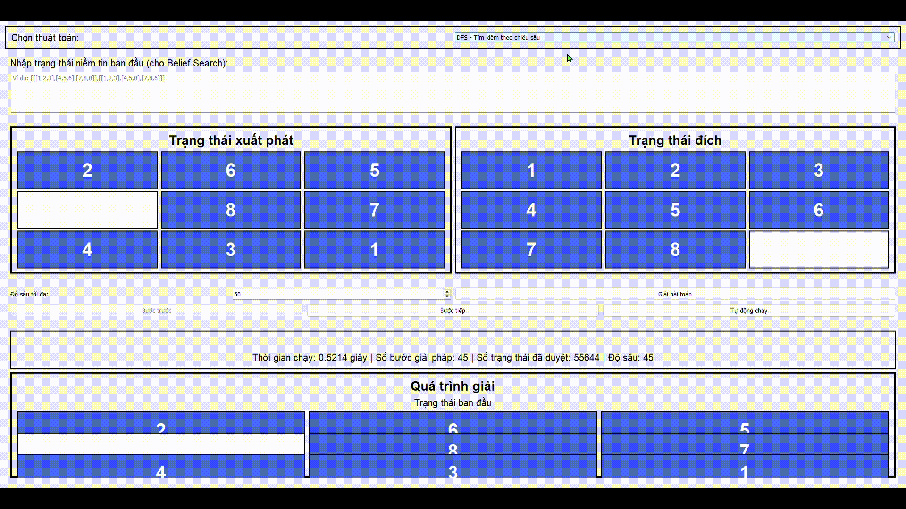

2. BFS - Tìm kiếm theo chiều rộng (Breadth-First Search)
Nguyên lý: Duyệt tất cả các trạng thái cùng độ sâu trước khi tăng độ sâu.
Ưu điểm: Luôn tìm được lời giải tối ưu (nếu tồn tại).
Nhược điểm: Tốn nhiều bộ nhớ và thời gian với không gian trạng thái lớn.
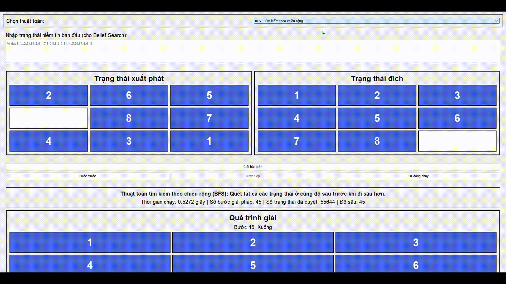

3. UCS - Tìm kiếm chi phí đồng nhất (Uniform Cost Search)
Nguyên lý: Mở rộng trạng thái có chi phí thấp nhất.
Ưu điểm: Tìm được lời giải tối ưu.
Nhược điểm: Chạy chậm nếu chi phí cao và không có heuristic.
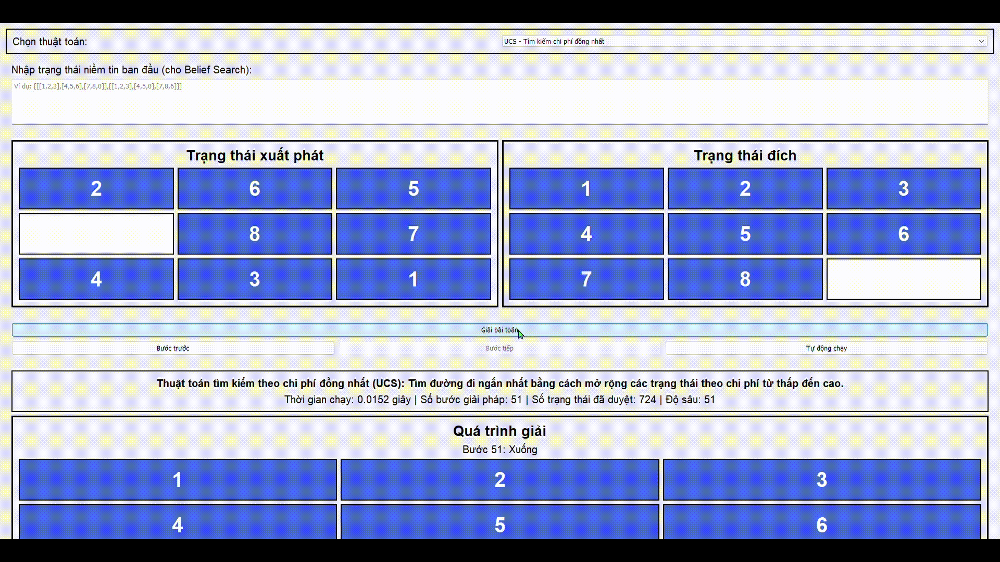

4. IDS - Tìm kiếm sâu dần (Iterative Deepening Search)
Nguyên lý: Lặp DFS với giới hạn độ sâu tăng dần.
Ưu điểm: Kết hợp lợi ích của DFS và BFS.
Nhược điểm: Lặp lại nhiều lần gây trùng lặp.
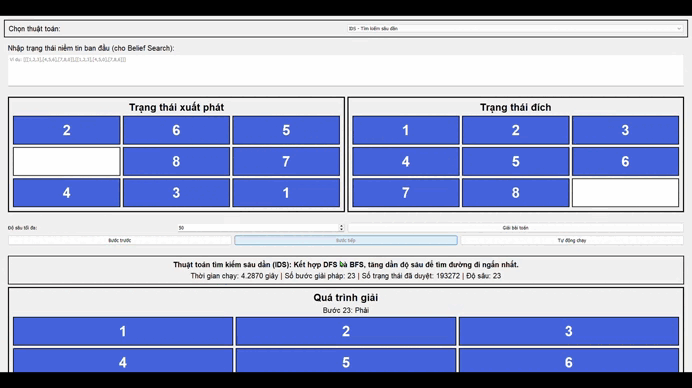

5. Greedy - Tìm kiếm tham lam
Nguyên lý: Ưu tiên trạng thái có heuristic nhỏ nhất.
Ưu điểm: Nhanh, dễ cài đặt.
Nhược điểm: Dễ bị kẹt ở cục bộ, không đảm bảo tối ưu.


6. A* - Tìm kiếm A*
Nguyên lý: f(n) = g(n) + h(n) (chi phí thực tế + ước lượng còn lại).
Ưu điểm: Cân bằng giữa tốc độ và độ chính xác, giải tốt nhất với heuristic phù hợp.
Nhược điểm: Tốn bộ nhớ, phụ thuộc chất lượng heuristic.
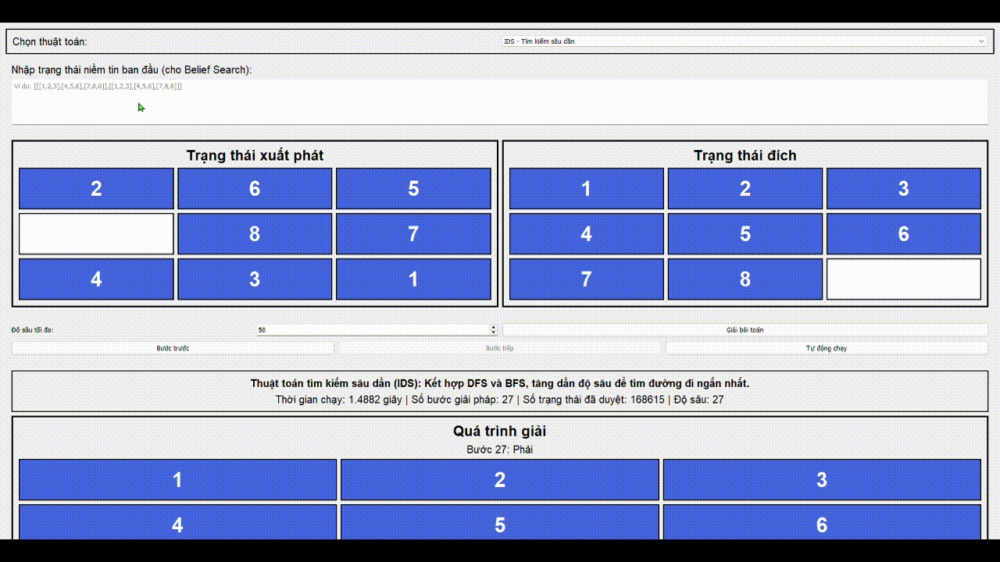

7. IDA* - Tìm kiếm A* lặp sâu (Iterative Deepening A*)
Nguyên lý: A* nhưng theo chiều sâu, với ngưỡng chi phí tăng dần.
Ưu điểm: Giảm dùng bộ nhớ so với A*.
Nhược điểm: Phải mở rộng lại nhiều trạng thái.


8. Simple HC - Leo đồi đơn giản (Hill Climbing)
Nguyên lý: Luôn chọn trạng thái tốt hơn hiện tại.
Ưu điểm: Nhanh, ít tài nguyên.
Nhược điểm: Kẹt tại cực trị cục bộ.


9. Steepest HC - Leo đồi dốc nhất
Nguyên lý: Dò toàn bộ hàng xóm, chọn cái tốt nhất.
Ưu điểm: Ít rơi vào cực trị hơn Simple HC.
Nhược điểm: Vẫn có thể kẹt, hiệu suất thấp hơn.
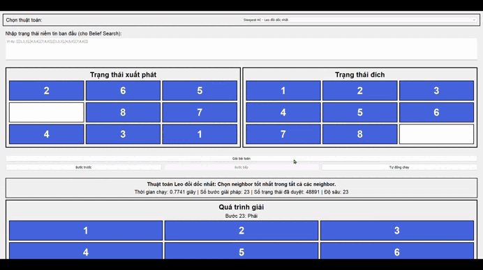

10. Stochastic HC - Leo đồi ngẫu nhiên
Nguyên lý: Chọn ngẫu nhiên hàng xóm cải thiện trạng thái.
Ưu điểm: Tránh bẫy cực trị tốt hơn HC thường.
Nhược điểm: Không đảm bảo tối ưu, kết quả phụ thuộc may mắn.
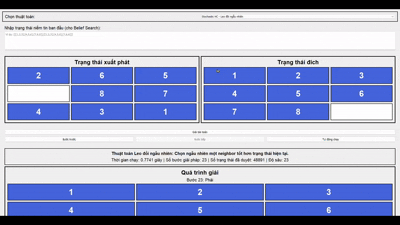

11. Beam Search - Tìm kiếm chùm
Nguyên lý: Chỉ giữ k trạng thái tốt nhất mỗi bước.
Ưu điểm: Giảm bộ nhớ, chạy nhanh.
Nhược điểm: Có thể bỏ sót lời giải tối ưu.
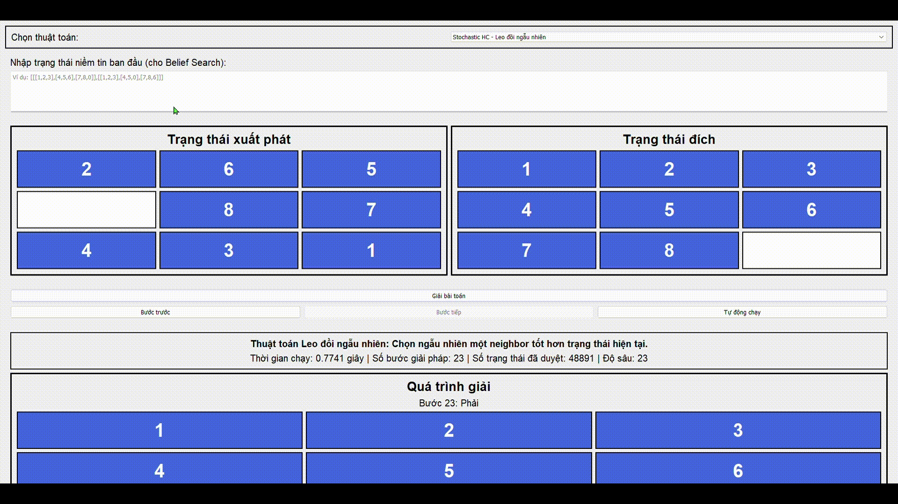

12. GA - Thuật toán di truyền (Genetic Algorithm)
Nguyên lý: Tiến hóa qua lai ghép và đột biến các cá thể (trạng thái).
Ưu điểm: Tìm giải gần tối ưu trong không gian lớn.
Nhược điểm: Chậm, không đảm bảo giải tốt nhất.
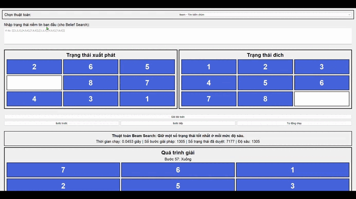

13. SA - Simulated Annealing
Nguyên lý: Chấp nhận trạng thái xấu theo xác suất, giảm dần theo thời gian.
Ưu điểm: Thoát bẫy cực trị tốt.
Nhược điểm: Cần tinh chỉnh tham số nhiệt độ, chậm nếu không đúng cách.
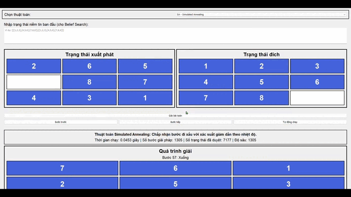

14. AND-OR Graph Search
Nguyên lý: Xây cây AND-OR để tìm giải quyết vấn đề có nhiều kết quả hoặc phụ thuộc điều kiện.
Ưu điểm: Phù hợp môi trường không xác định.
Nhược điểm: Quá phức tạp cho 8-puzzle.
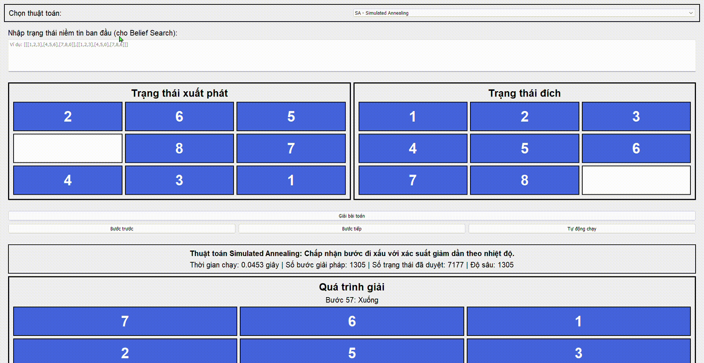

15. Belief State Search
Nguyên lý: Tìm kiếm trong không gian các trạng thái có thể (niềm tin).
Ưu điểm: Giải được bài toán thiếu thông tin.
Nhược điểm: Không cần thiết cho 8-puzzle (môi trường xác định).
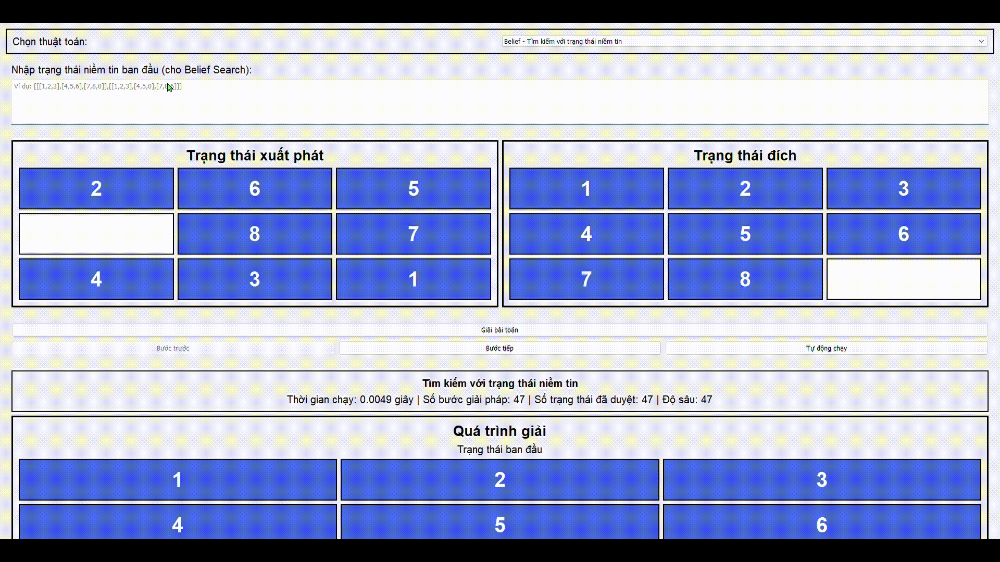

16. Partial Observability Search
Nguyên lý: Áp dụng trong môi trường không quan sát đầy đủ.
Ưu điểm: Giải bài toán robot không nhìn toàn bản đồ.
Nhược điểm: Quá dư thừa cho 8-puzzle.
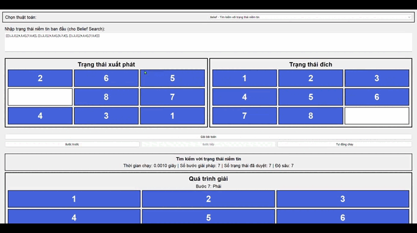

17. Backtracking - Quay lui
Nguyên lý: Duyệt từng bước, lùi lại khi không còn lựa chọn.
Ưu điểm: Cần ít bộ nhớ, dễ cài.
Nhược điểm: Rất chậm, dễ lặp lại, không hiệu quả với 8-puzzle.
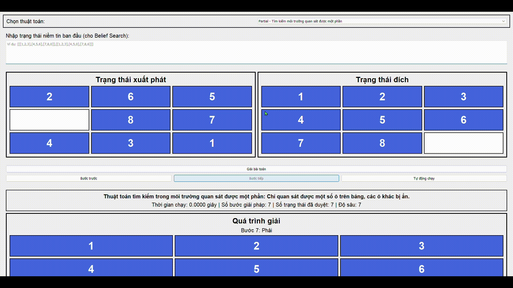

18. Q-Learning - Học tăng cường Q
Nguyên lý: Học chính sách hành động tối ưu thông qua thử và sai.
Ưu điểm: Tự học mà không cần mô hình môi trường.
Nhược điểm: Cần thời gian học dài, phức tạp cho bài toán nhỏ như 8-puzzle.
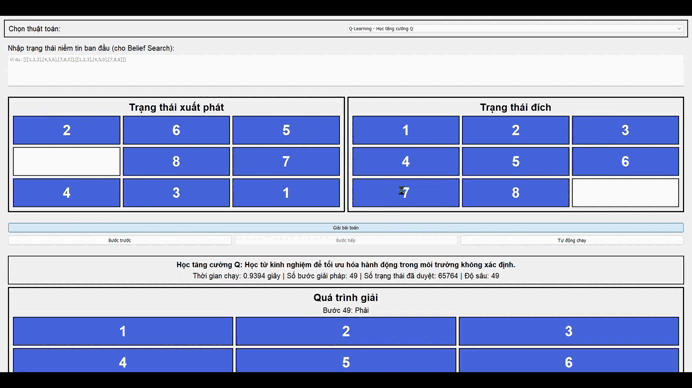

### 📊 Bảng So Sánh Hiệu Năng Các Thuật Toán Giải 8-Puzzle

| Thuật toán               | Số bước giải pháp | Trạng thái đã duyệt | Độ sâu giải được | Thời gian chạy (s) | Ghi chú |
|--------------------------|-------------------|----------------------|------------------|---------------------|---------|
| **DFS**                 | 45                | 55,644               | 45               | 0.4864              | Giới hạn độ sâu 50 |
| **BFS**                 | 23                | 91,351               | 23               | 1.5397              | Tối ưu độ dài |
| **UCS**                 | 23                | 214,585              | 23               | 6.1250              | Chi phí đồng nhất |
| **IDS**                 | 27                | 168,615              | 27               | 2.1241              | Kết hợp DFS + BFS |
| **A\***                 | 133               | 2,700                | 133              | 0.0497              | Dùng heuristic |
| **IDA\***               | 23                | 48,891               | 23               | 0.7950              | Tối ưu + tiết kiệm bộ nhớ |
| **Greedy**              | 51                | 724                  | 51               | 0.0144              | Nhanh nhưng không tối ưu |
| **Simple HC**           | ✗                 | -                    | -                | -                   | Không tìm thấy lời giải |
| **Steepest HC**         | ✗                 | -                    | -                | -                   | Không tìm thấy lời giải |
| **Stochastic HC**       | ✗                 | -                    | -                | -                   | Không tìm thấy lời giải |
| **Beam Search**         | 1305              | 7,177                | 1305             | 0.0483              | Giải được nhưng rất dài |
| **Genetic Algorithm**   | ✗                 | -                    | -                | -                   | Không hội tụ |
| **Simulated Annealing** | ✗                 | -                    | -                | -                   | Không hội tụ |
| **AND-OR Search**       | ✗                 | -                    | -                | -                   | Không phù hợp |
| **Belief State Search** | 1:None            | -                    | -                | -                   | Không rõ trạng thái kế tiếp |
| **Partial Observable**  | 1:None            | -                    | -                | -                   | Không hiệu quả |
| **Backtracking**        | 49                | 65,764               | 49               | 0.9086              | Cần kiểm tra lặp |
| **Q-Learning**          | 75                | 1,470,475            | 75               | 32.3161             | Học tăng cường, rất chậm |

### Ghi chú:
- ✗: Không tìm thấy lời giải.
- Trạng thái đã duyệt: số node trong không gian trạng thái được mở rộng.
- Số bước giải pháp: số hành động từ trạng thái ban đầu đến mục tiêu.
- Heuristic mặc định (nếu có): thường là số ô sai hoặc Manhattan distance.

## Kết luận
Từ kết quả thực nghiệm, chúng ta có thể rút ra một số kết luận quan trọng:

1. **Thuật toán hiệu quả nhất:**
   - A* và IDA* cho thấy hiệu suất tốt nhất về mặt thời gian và bộ nhớ
   - BFS và UCS tìm được lời giải tối ưu nhưng tốn nhiều tài nguyên

2. **Thuật toán không phù hợp:**
   - Các thuật toán tìm kiếm cục bộ (Hill Climbing) không hiệu quả
   - Các thuật toán môi trường phức tạp không cần thiết cho bài toán này

3. **Đề xuất sử dụng:**
   - Nên sử dụng A* hoặc IDA* cho các bài toán 8-puzzle
   - Cần chọn heuristic phù hợp để tối ưu hiệu suất

## Cài đặt và Chạy
1. Yêu cầu hệ thống:
   - Python 3.x
   - Các thư viện cần thiết (numpy, time, collections)

2. Cách chạy:
   ```bash
   python DO_AN_CA_NHAN.py
   ```

3. Cấu trúc thư mục:
   ```
   DO_AN_CA_NHAN/
   ├── README.md
   ├── DO_AN_CA_NHAN.py
   ```

## Tài liệu tham khảo
1. Artificial Intelligence: A Modern Approach (Stuart Russell & Peter Norvig)
2. Introduction to Algorithms (Thomas H. Cormen)
